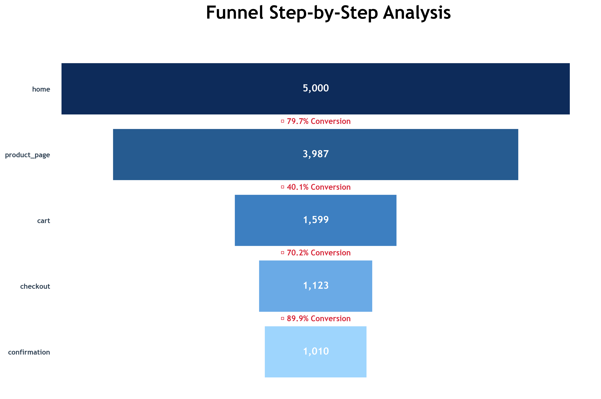
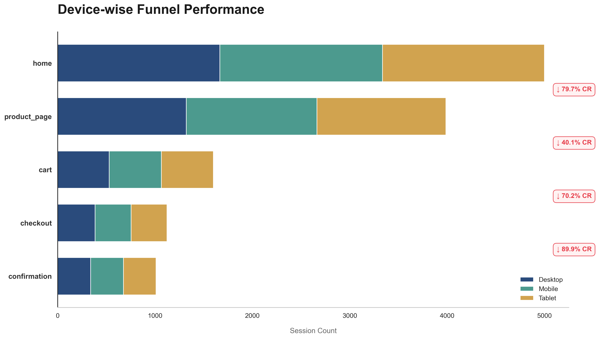
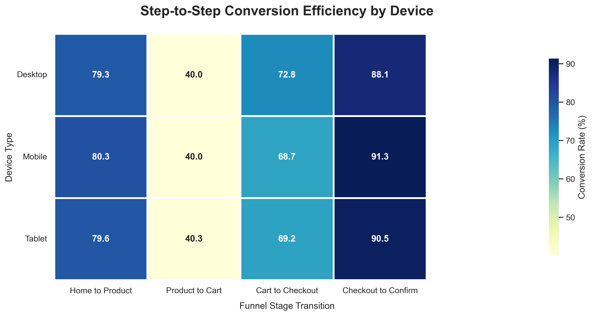
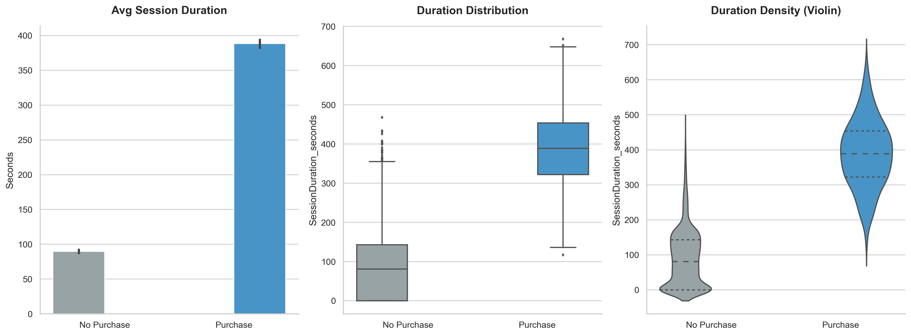
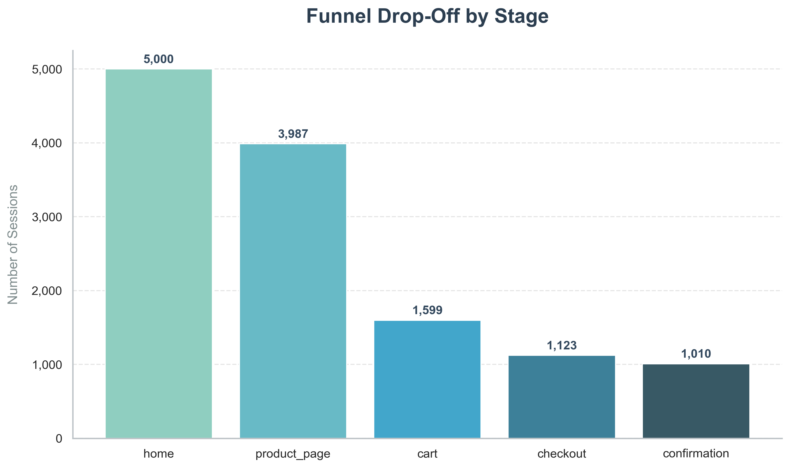
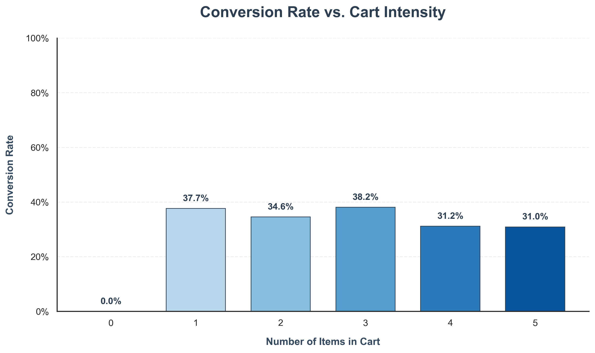
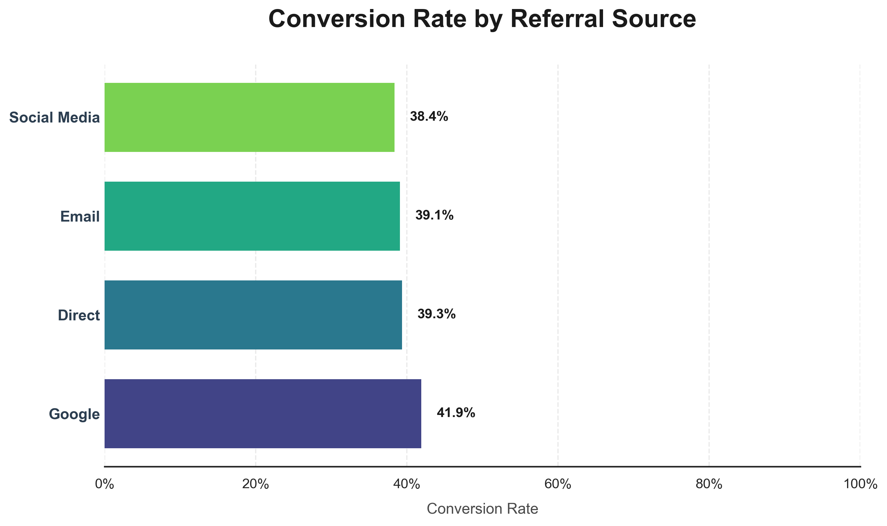
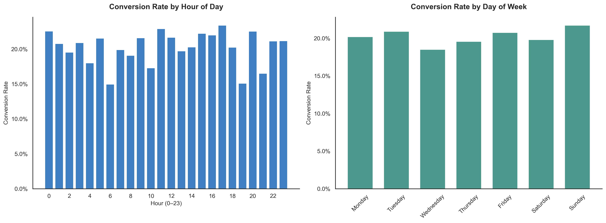

<div align="center">

# Funnel Drop Analysis

**Python | Pandas | Matplotlib | Seaborn | SciPy**

This project breaks down the online shopping journey step by step to find where users drop off and what causes it.


[](https://colab.research.google.com/github/analytics-ak/funnel-drop-analysis/blob/main/funnel_drop_analysis.ipynb)
[](https://mybinder.org/v2/gh/analytics-ak/funnel-drop-analysis/main?labpath=funnel_drop_analysis.ipynb)

</div>

---

## Problem Statement
Most users visit an online store but do not complete a purchase.

The key question is: **At which exact step do users drop off the most, and what causes it?**

## What This Project Does

- Tracks how users move through 5 funnel stages: **Home → Product Page → Cart → Checkout → Confirmation**
- Finds exactly where users drop off and how many are lost at each step
- Tests whether device type, referral source, time of visit, or session duration explains the drop
- Uses statistical tests (chi-square) instead of just eyeballing charts
- Validates that the funnel data is clean before running any calculations
- Ends with clear, actionable business recommendations

---

## The Dataset

| Detail | Info |
|--------|------|
| **Source** | [Kaggle — E-Commerce Funnel Data](https://www.kaggle.com/datasets/sufya6/e-commerce-customer-journey-click-to-conversion) |
| **Total Rows** | 12,719 |
| **Total Sessions** | 5,000 |
| **Columns** | 10 |
| **Time Period** | January 2025 – August 2025 |
| **Type** | Synthetic (acknowledged in the analysis) |

Each row represents one step in a user's journey. A single session can have multiple rows — for example, a user who goes from Home → Product Page → Cart would have 3 rows.

### Columns

| Column | What It Tells Us |
|--------|-----------------|
| SessionID | Unique ID for each visit |
| UserID | Who the visitor is |
| Timestamp | When they visited |
| PageType | Which page they were on (home, product_page, cart, checkout, confirmation) |
| DeviceType | Desktop, Mobile, or Tablet |
| Country | Where they're from |
| ReferralSource | How they found the site (Google, Email, Direct, Social Media) |
| TimeOnPage_seconds | How long they stayed on that page |
| ItemsInCart | How many items they added to cart |
| Purchased | 1 = bought something, 0 = didn't |

---

## Key Insights (What the Data Shows)

### 1. The Biggest Problem — Product Page → Cart

Nearly **60% of users drop off** between the Product Page and the Cart. This is the single biggest leak in the entire funnel.



| Funnel Step | Sessions | Drop to Next Step |
|------------|----------|------------------|
| Home | 5,000 | 20.26% |
| Product Page | 3,987 | **59.89%** |
| Cart | 1,599 | 29.77% |
| Checkout | 1,123 | 10.06% |
| Confirmation | 1,010 | — |

Once users add something to the cart, most of them actually finish buying. The problem isn't checkout — it's getting people to take that first action.

---

### 2. Device Doesn't Matter

Desktop, Mobile, and Tablet users all behave almost identically. No device performs significantly worse than the others.





**Chi-square test result:** p-value = 0.98 — statistically zero difference between devices.

---

### 3. Session Duration — Buyers vs Non-Buyers

Non-buyers spend about **90 seconds** on the site. Buyers spend around **388 seconds** — over 4x longer. Buyers simply go through more steps, so they're on the site longer.



---

### 4. Product Page Time is the Same for Everyone

This was surprising. Buyers and non-buyers both spend roughly **96–97 seconds** on the product page. So the product page is getting attention — it's just not convincing people to add to cart.



---

### 5. The First Item is the Tipping Point

Sessions with **0 items** in cart have **0% conversion**. The moment someone adds just **1 item**, conversion jumps to **35–38%**. Adding more items after that doesn't change much.

The real battle is getting that first item into the cart.



---

### 6. Referral Source Doesn't Explain the Drop

Google converts slightly better (~42%) than Social Media (~38%), but the gap is small. All sources show the same funnel pattern.



**Chi-square test result:** p-value = 0.47 — no significant difference between referral sources.

---

### 7. Time of Visit Doesn't Matter Either

Conversion rates are flat across all hours (20–23%) and all days of the week (18–22%). No meaningful pattern.



---

## What Was Ruled Out

| Factor | Tested How | Result |
|--------|-----------|--------|
| Device Type | Chi-square test | No difference (p = 0.98) |
| Referral Source | Chi-square test | No difference (p = 0.47) |
| Time of Visit | Hour & day analysis | No pattern |
| Product Page Engagement | Avg time comparison | Same for buyers & non-buyers |

---

## Initial Assumptions vs What the Data Showed

| Assumption | What I Expected | What Actually Happened |
|-----------|----------------|----------------------|
| Most users drop between Product Page and Cart | ✅ True | 60% drop — the biggest in the funnel |
| Mobile users convert less than Desktop | ❌ False | All devices perform the same (p = 0.98) |
| More time on page = more likely to buy | ❌ False | Buyers and non-buyers spend the same time on product pages |
| Social Media traffic converts worse | ❌ False | All sources are similar (p = 0.47) |
| More items in cart = higher conversion | ⚠️ Partially True | First item matters most, after that it flattens |

---

## Business Recommendations

The Product Page is where the funnel breaks. Users are looking at products but not adding them to the cart. Here's what could help:

- **Make "Add to Cart" more visible** — if users can't find it easily, they won't click it
- **Improve product images and descriptions** — give people a clear reason to buy
- **Show pricing and value upfront** — don't make users guess
- **Add trust signals** — reviews, ratings, guarantees, return policies

Small improvements here will have the biggest impact on revenue, because this is where most users are lost.

---

## Final Conclusion  

The main issue is not traffic, device, or checkout. The biggest loss happens when users fail to move from the Product Page to the Cart. Users are interested, but not convinced to act. Improving this step will have the highest impact on conversion and revenue.

---

## Data Quality Checks Done Before Analysis

This project doesn't just jump into charts. Before any analysis, the data were validated:

- **No missing values** across all 10 columns
- **Funnel path validation** — checked all 5,000 sessions to confirm they follow the correct step order (Home → Product → Cart → Checkout → Confirmation). Every single session follows the funnel perfectly, which also confirms the dataset is synthetic.
- **Timestamp conversion** — converted to datetime and sorted by session and time

---

## A Note About the Data

After working with this dataset, I noticed that the numbers across devices, referral sources, and countries are almost the same. In real life, that never happens — mobile users usually behave differently from desktop, and paid traffic converts differently from organic.

This dataset is most likely **synthetically generated**. I called this out in the notebook because recognising data limitations is just as important as analysing the data itself.

That said, the analysis approach, funnel logic, statistical tests, and the way findings are connected — all of that works the same whether the data is real or synthetic.

---

## Tools & Libraries

| Tool | Used For |
|------|----------|
| Python | Data cleaning, analysis, funnel calculations |
| Pandas | Session-level and page-level data operations |
| NumPy | Numerical computations |
| Matplotlib | Funnel charts, bar charts, comparison plots |
| Seaborn | Heatmaps, violin plots, styled visuals |
| SciPy | Chi-square statistical tests |
| Jupyter Notebook | Building the full analysis step by step |

---

## Project Structure

```
funnel-drop-analysis/
│
├── funnel_drop_analysis.ipynb    # Full analysis notebook
├── README.md                     # This file
│
└── images/                       # All charts generated by the notebook
    ├── 01_funnel_analysis.png
    ├── 02_device_funnel.png
    ├── 03_device_conversions_heatmap.png
    ├── 04_session_analysis_highres.png
    ├── 05_funnel_analysis_premium.png
    ├── 06_conversion_rate_analysis.png
    ├── 07_referral_conversion_premium.png
    └── 08_time_based_conversion.png
```

---

## How to Run This Project

1. Clone this repo
   ```bash
   git clone https://github.com/yourusername/funnel-drop-analysis.git
   ```
2. Install the required libraries
   ```bash
   pip install pandas numpy matplotlib seaborn scipy
   ```
3. Open the notebook
   ```bash
   Jupyter Notebook funnel_drop_analysis.ipynb
   ```
4. Run all cells — charts will generate automatically

---

## Profile & Dataset

* 🔗 **LinkedIn:** [View My Profile](https://www.linkedin.com/in/analytics-ashish/)
* 📂 **Dataset:** [Funnel Simulation Dataset on Kaggle](https://www.kaggle.com/datasets/sufya6/e-commerce-customer-journey-click-to-conversion)
* 💻 **GitHub Repository:** [Funnel Drop Analysis](https://github.com/analytics-ak/funnel-drop-analysis/)
* 📘 **Notebook:** [funnel-drop.ipynb](https://github.com/analytics-ak/funnel-drop-analysis/blob/main/funnel_drop_analysis.ipynb)

<br>

## Author  

**Ashish Kumar Dongre**  
Data Analyst  

- Python | Pandas | Data Analysis  
- Focus: **Business-driven data insights**
